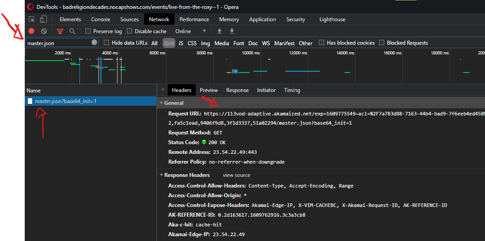

# Vimeo Downloader #

Script utilitário para baixar vídeos da plataforma [Vimeo](https://vimeo.com/).

Desenvolvido em Python 3.9 tirando proveito do AsyncIO, tem por objetivo fazer download dos segmentos de um 
vídeo da plataforma [Vimeo](https://vimeo.com/).

O projeto foi inspirado à partir deste script: https://gist.github.com/mistic100/895f6d17b1e193334882a4c37d0d7748

## Instruções para uso: ##

- Crie um arquivo local chamado `config.ini` com a seguinte estrutura:

```ini
[GENERAL]
URL_MASTER=
DIR_TEMP=
```

- Crie um diretório, vazio, de trabalho e informe na chave `DIR_TEMP`  

- Abra o site com o vídeo desejado, e com o DevTools acionado dê play no vídeo.  

- Procure na aba "Network" a solicitação para `master.json` e informe a URL completa em `URL_MASTER`  



- Coloque o projeto em execução  

- Ao fim do processo sobrarão dois arquivos no diretório de trabalho:
    - @audio.mp4 - Com o áudio 
    - @video.mp4 - Com o vídeo 
    
- Utilize o software [MKVToolnix](https://mkvtoolnix.br.uptodown.com/windows) (ou similar) para juntar os arquivos

👉🏻 Se gostou do que viu, me pague um cafezinho: Pix - jmarioguedes@gmail.com

- Seja feliz!


## Pendências: ##

[] Criar um arquivo Docker e Docker Compose  
[] Juntar os arquivos via comando SH como neste projeto:  
    https://github.com/Tusko/vimeo-private-downloader/blob/master/vimeo-combine.sh  
[] Cobertura de testes  